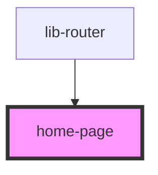

# home-page

<!-- Auto Generated Below -->

## Properties

| Property | Attribute | Description | Type     | Default     |
| -------- | --------- | ----------- | -------- | ----------- |
| `name1`  | `name-1`  |             | `string` | `undefined` |
| `type`   | `type`    |             | `string` | `undefined` |

## Dependencies

### Used by

 - [lib-router](../web-router)

### Graph

----------------------------------------------

*Built with [StencilJS](https://stenciljs.com/)*
