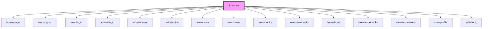

# lib-router

<!-- Auto Generated Below -->

## Dependencies

### Depends on

- [home-page](../home-page)
- [user-signup](../user-signup)
- [user-login](../user-login)
- [admin-login](../admin-login)
- [admin-home](../admin-home)
- [add-books](../add-books)
- [view-users](../view-users)
- [user-home](../user-home)
- [view-books](../view-books)
- [user-viewbooks](../user-viewbooks)
- [issue-book](../issue-book)
- [view-issuebooks](../view-issuebooks)
- [view-issuestatus](../view-issuestatus)
- [user-profile](../user-profile)
- [edit-book](../edit-book)

### Graph

----------------------------------------------

*Built with [StencilJS](https://stenciljs.com/)*
